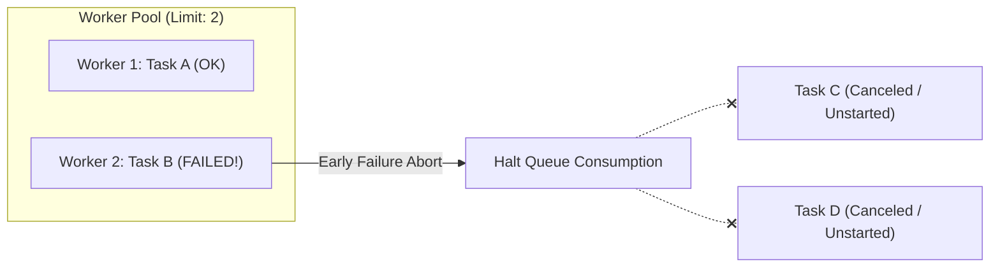

# Concurrency

Fine-grained worker pool concurrency and early-abort failure protection for asynchronous task workflows.


## What is Concurrency?

`Concurrency` is a lightweight `extension type` that defines how collections of asynchronous operations are scheduled and executed across the Dart event loop.

You can use `Concurrency` as a **standalone worker pool runner** for any custom asynchronous closures (`Future<T> Function()`), or seamlessly with `Task` and `TaskEither`.

Instead of running unbounded parallel futures that flood downstream APIs or sequential loops that crawl slowly, `Concurrency` lets you specify exact worker pool limits with clean, expressive syntax.

```dart
// Standalone: Process raw async functions with a worker pool of 4
final results = await const Concurrency.bounded(4).process(
  urls.map((url) => () => http.get(Uri.parse(url))),
);

// Or pass directly to Task / TaskEither using dot-shorthand syntax
final taskResults = await TaskEither.sequence(tasks, mode: .bounded(3)).run();
```


## Why You Need It

Managing concurrency in standard Dart is fraught with trade-offs:

1. **Unbounded Parallelism (`Future.wait`)**: Dispatches every single future immediately. If you have 500 tasks, you launch 500 concurrent connections, triggering HTTP 429 rate limits, memory spikes, or backend database exhaustion.
2. **Naive Chunking / Batching**: Splitting a list into chunks (e.g., chunks of 5) forces the entire chunk to wait until the slowest task in that chunk finishes before starting the next chunk.
3. **Redundant Work After Failures**: If the 2nd task in a 100-task batch fails, standard Dart continues running the remaining 98 tasks needlessly, burning network bandwidth and compute resources.


## Concurrency Modes

`Concurrency` provides three distinct modes:

| Mode | Shorthand | Behavior | Best Used For |
| :--- | :--- | :--- | :--- |
| **Bounded** | `.bounded(limit)` | Dynamic sliding-window worker pool of `limit` active workers. Available workers pull the next task immediately. | High-throughput batch operations, file downloads, API syncing with rate limits. |
| **Sequential** | `.sequential` | Exactly 1 task active at a time. Task `N+1` never starts until Task `N` completes. | State-dependent writes, ordered log processing, database migrations. |
| **Unbounded** | `.unbounded` | Dispatches all tasks to the event loop simultaneously without limits. | Fast in-memory computations, low-volume independent queries. |


## Key Features

### 1. Dynamic Sliding-Window Worker Pool
In bounded mode (`.bounded(limit)`), tasks are processed through an active pool of `limit` worker slots. 

As soon as any worker completes its task, it immediately pulls the next pending task from the queue without waiting for slower tasks in other slots. Fast tasks never sit idle behind slow tasks.

```dart
final imageIds = List.generate(50, (i) => 'img_$i');

// Process 50 images with 4 active worker slots:
final TaskEither<DownloadError, List<ImageFile>> downloadBatch = TaskEither.traverse(
  imageIds,
  (id) => downloadImageSafe(id),
  mode: .bounded(4),
);

final result = await downloadBatch.run();
```

### 2. Early Failure Abort (Resource Protection)
In `TaskEither.sequence` and `TaskEither.traverse`, if any task fails and resolves to a `Left`, the worker queue **locks immediately**. 

Unstarted pending tasks in the queue are canceled and never dispatched to the network or event loop. In-flight workers finish gracefully, and the failure is returned promptly.



### 3. Deterministic Result Ordering
Regardless of task completion timing (even if Task 3 finishes before Task 1), results are always collected and returned in the **exact original order** of the input collection.

### 4. Dart Dot-Shorthand Syntax
Leverage Dart's constructor tear-off and dot-shorthand syntax for clean, legible calls:

```dart
Task.sequence(tasks, mode: .sequential);
Task.sequence(tasks, mode: .bounded(5));
Task.sequence(tasks, mode: .unbounded);
```


## Standalone Usage: `dispatch` and `process`

You don't have to use `Task` or `TaskEither` to benefit from `Concurrency`. It provides two standalone methods to run asynchronous workflows:

* **`concurrency.dispatch(items, worker)`**: Best when you have a collection of raw data items and an async worker function. Eliminates nested closure boilerplate and supports direct function tear-offs.
* **`concurrency.process(thunks)`**: Best when you already have a list of zero-argument async task functions `Iterable<Future<T> Function()>`.

```dart
import 'package:daxle/daxle.dart';

void main() async {
  final userIds = [101, 102, 103, 104, 105, 106, 107];

  // 1. dispatch: Cleanly map items to an async function with 3 concurrent workers
  final List<User> users = await const Concurrency.bounded(3).dispatch(
    userIds,
    (id) => api.fetchUser(id), // or tear-off: api.fetchUser
  );
  print('Fetched ${users.length} users.');

  // 2. dispatch with early-stop condition (shouldStop):
  final results = await const Concurrency.bounded(2).dispatch(
    userIds,
    api.fetchUser,
    // Halt queue consumption immediately if any user is flagged as suspended:
    shouldStop: (user) => user.isSuspended,
  );

  // 3. process: Run a list of pre-built zero-argument async task functions (using tear-offs)
  final List<Future<void> Function()> maintenanceJobs = [
    syncDatabase,
    flushCaches,
    purgeLogs,
  ];
  await Concurrency.sequential.process(maintenanceJobs);
}
```


## Best Practices

* **Default to Bounded**: Unless you have specific ordering constraints, use `.bounded(3)` (the default) or `.bounded(5)` to balance throughput and server load.
* **Use Sequential for Dependent Steps**: If task `B` relies on side-effects produced by task `A`, use `mode: .sequential`.
* **Guard Sensitive Endpoints**: When calling external third-party APIs with strict rate limits, set `.bounded(2)` or `.bounded(3)` to stay safely under capacity.


## Related Types

* [Task](task) - Lazy asynchronous computations with concurrency controls.
* [TaskEither](task-either) - Fallible lazy async operations with sliding-window worker pools and early failure short-circuiting.
