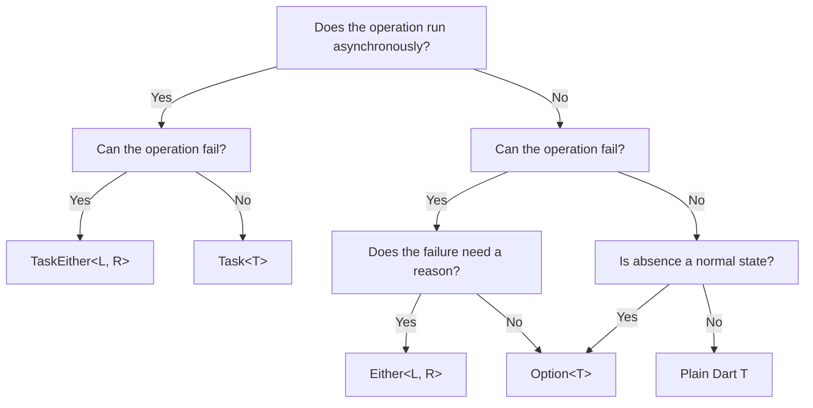

# Best Practices

Adopting functional types like `Either`, `Option`, and `Task` can significantly improve code safety and predictability. However, without guidelines, codebases can become hard to read due to nested logic, poor naming, or inappropriate type choices.

This guide provides practical recommendations for writing clean, maintainable, and idiomatic Daxle code.

---

## 1. Naming Conventions

### Let the Return Type Speak
When writing functions that return Daxle types, use standard, active verbs. You do not need to add prefixes or suffixes like `Task` or `Either` to the function name, as the return type already conveys this information.

```dart
// ❌ AVOID: Adding type jargon to function names
TaskEither<NetworkError, String> fetchHtmlTask(String url) { ... }

//  PREFER: Natural, descriptive names
TaskEither<NetworkError, String> fetchHtml(String url) { ... }
```

### Distinguish Between Eager and Lazy Actions
If you have a function that executes immediately (returns a `Future`) alongside a function that is lazy (returns a `Task` or `TaskEither`), use clear descriptors (like `Run` or `Safe`) to distinguish them.

```dart
// Returns an eager Future (can throw exceptions)
Future<void> writeConfig(Config config) { ... }

// Returns a lazy, type-safe TaskEither
TaskEither<ConfigError, Unit> writeConfigSafe(Config config) { ... }
```

---

## 2. Choosing the Right Type

Choosing the correct type keeps your APIs simple and prevents overhead.



### Option vs. Either
* Use **`Option<T>`** when a value might be absent as part of normal program flow, and the *reason* for its absence is either obvious or irrelevant.
* Use **`Either<L, R>`** when an operation can fail, and you need to explain *why* it failed using a specific error object or code.

```dart
// ❌ AVOID: Using Either when no failure context is needed
Either<Unit, String> getMiddleName(User user) { ... }

//  PREFER: Using Option for optional values
Option<String> getMiddleName(User user) { ... }
```

### Task vs. TaskEither
* Use **`Task<T>`** for lazy asynchronous operations where failures are either impossible or represent developer bugs that should throw standard Dart exceptions.
* Use **`TaskEither<L, R>`** for all I/O, network requests, database queries, and parser executions where asynchronous failures are expected and must be handled.

---

## 3. Avoid Unnecessary Nesting

A common mistake is calling `.fold()` in the middle of a pipeline and returning another container. This introduces indentation and ruins the readability of your composition chain.

### The Nested "Fold" Anti-pattern

```dart
// ❌ AVOID: Nested folds that cause callback nesting
TaskEither<ConfigError, Unit> updatePort(String path, String portInput) {
  return loadConfigSafe(path).flatMap((config) {
    final parsedPort = int.tryParse(portInput);
    
    // Nested fold introduces unnecessary branch matching
    return Option.fromNullable(parsedPort).fold(
      () => TaskEither.left(ConfigError.invalidPort()),
      (port) => saveConfigSafe(config.copyWith(port: port)),
    );
  });
}
```

### The Flattened Pipeline

Instead of folding mid-pipeline, convert your inner types using combinators like `flatMap` and `TaskEither.fromEither` or `TaskEither.fromEither(Option.fold...)` to keep the chain flat.

```dart
//  PREFER: Converting and chaining flat operations
TaskEither<ConfigError, Unit> updatePortFlat(String path, String portInput) {
  return loadConfigSafe(path).flatMap((config) {
    return TaskEither.fromEither(
      Option.fromNullable(int.tryParse(portInput))
          .fold(
            () => Either.left(ConfigError.invalidPort()),
            (port) => Either.right(config.copyWith(port: port)),
          ),
    ).flatMap((updatedConfig) => saveConfigSafe(updatedConfig));
  });
}
```

---

## 4. Catch Exceptions at System Boundaries

Standard Dart packages and core libraries throw exceptions (e.g. `SocketException`, `FormatException`). 

**Never let raw exceptions leak into your domain or business logic layers.**

Wrap them in `Either.tryCatch` or `TaskEither.fromFuture` at the lowest possible layer (e.g. at the HTTP client or Database helper level) and map them to explicit domain errors.

```dart
// ❌ AVOID: Leaking exceptions from helper layers
class NetworkService {
  // If connection fails, this throws SocketException!
  Future<String> fetchRawData(String url) => httpClient.read(Uri.parse(url));
}

//  PREFER: Converting exceptions to typed errors at the boundary
class SafeNetworkService {
  TaskEither<NetworkError, String> fetchRawData(String url) {
    return TaskEither.fromFuture(
      () => httpClient.read(Uri.parse(url)),
      (error, stackTrace) => NetworkError.connectionFailed(error.toString()),
    );
  }
}
```

This keeps your business logic clean, predictable, and 100% free of uncaught runtime crashes.
