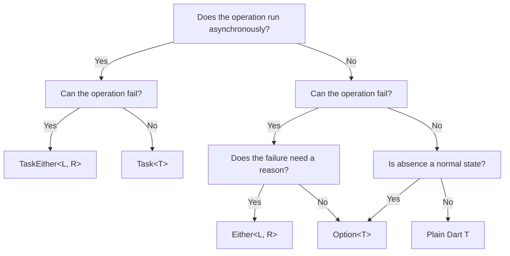

# Best Practices

Daxle's functional types—`Either`, `Option`, and `Task`—make your code safer and more predictable. But without a clear strategy, you risk creating tangled, unreadable code.

Follow these practical guidelines to write clean, maintainable, and idiomatic Daxle code that your team will love.


## 1. Write Code That Reads Like English

### Let the Return Type Speak
When returning Daxle types, use strong, active verbs. Skip the `Task` or `Either` suffixes—the return type already tells you exactly what to expect.

```dart
// ❌ AVOID: Adding type jargon to function names
TaskEither<NetworkError, String> fetchHtmlTask(String url) { ... }

//  PREFER: Natural, descriptive names
TaskEither<NetworkError, String> fetchHtml(String url) { ... }
```

### Distinguish Between Eager and Lazy Actions
Mixing immediate `Future`s with lazy `Task`s? Use clear adjectives like `Run` or `Safe` to instantly tell them apart.

```dart
// Returns an eager Future (can throw exceptions)
Future<void> writeConfig(Config config) { ... }

// Returns a lazy, type-safe TaskEither
TaskEither<ConfigError, Unit> writeConfigSafe(Config config) { ... }
```


## 2. Pick the Perfect Type

Choosing the right type keeps your API snappy and lightweight.



### When to Use Option vs. Either
* Grab **`Option<T>`** when an absent value is normal program flow. You don't need to explain *why* it's missing.
* Grab **`Either<L, R>`** when an operation fails and you must explain *why* using a precise error object or code.

```dart
// ❌ AVOID: Using Either when no failure context is needed
Either<Unit, String> getMiddleName(User user) { ... }

//  PREFER: Using Option for optional values
Option<String> getMiddleName(User user) { ... }
```

### When to Use Task vs. TaskEither
* Choose **`Task<T>`** for lazy async operations that simply cannot fail, or when failures are developer bugs that should crash loudly as standard exceptions.
* Choose **`TaskEither<L, R>`** for all I/O—database queries, network requests, and file reads. If it can fail asynchronously, handle it safely with `TaskEither`.


## 3. Flatten Your Pipelines

Calling `.fold()` mid-pipeline creates deep nesting and destroys readability. Keep your chains perfectly flat.

### The Trap: Nested Folds

```dart
// ❌ AVOID: Nested folds that cause callback nesting
TaskEither<ConfigError, Unit> updatePort(String path, String portInput) {
  return loadConfigSafe(path).flatMap((config) {
    final parsedPort = int.tryParse(portInput);
    
    // Nested fold introduces unnecessary branch matching
    return Option(parsedPort).fold(
      () => TaskEither.left(ConfigError.invalidPort()),
      (port) => saveConfigSafe(config.copyWith(port: port)),
    );
  });
}
```

### The Fix: Keep It Flat

Instead of folding in the middle, use combinators like `flatMap` and `TaskEither.fromEither` to keep your pipeline completely flat and readable.

```dart
//  PREFER: Converting and chaining flat operations
TaskEither<ConfigError, Unit> updatePortFlat(String path, String portInput) {
  return loadConfigSafe(path).flatMap((config) {
    return TaskEither.fromEither(
      Option(int.tryParse(portInput))
          .fold(
            () => Either.left(ConfigError.invalidPort()),
            (port) => Either.right(config.copyWith(port: port)),
          ),
    ).flatMap((updatedConfig) => saveConfigSafe(updatedConfig));
  });
}
```


## 4. Trap Exceptions at the Boundary

Standard libraries throw exceptions (e.g. `SocketException`, `FormatException`). 

**Never let them leak into your clean business logic.**

Wrap them in `Either.tryCatch` or `TaskEither.fromFuture` at the lowest possible layer (like your HTTP client or Database helper). Map them directly to clear domain errors.

```dart
// ❌ AVOID: Leaking exceptions from helper layers
class NetworkService {
  // If connection fails, this throws SocketException!
  Future<String> fetchRawData(String url) => httpClient.read(Uri.parse(url));
}

//  PREFER: Converting exceptions to typed errors at the boundary
class SafeNetworkService {
  TaskEither<NetworkError, String> fetchRawData(String url) {
    return TaskEither.fromFuture(
      () => httpClient.read(Uri.parse(url)),
      (error, stackTrace) => NetworkError.connectionFailed(error.toString()),
    );
  }
}
```

This guarantees your business logic stays pure, predictable, and 100% crash-free.
