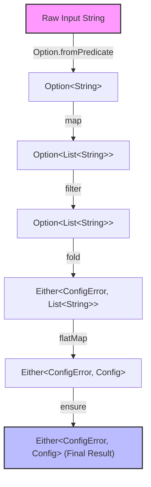

# Functional Composition

Functional composition is the practice of building software by chaining together small, single-responsibility functions. Instead of writing imperative blocks of code with temporary variables and manual checks, you define a data pipeline where the output of one step becomes the input of the next.

Daxle provides a fluent API on its core types to make composing pipelines simple and readable.

---

## The Core Combinators

To build pipelines, you need a set of tools to transform and direct values as they flow through your code. Daxle provides several key operators (combinators) to do this.

### `map`
Use `map` to transform a successful value inside a container. If the container is in a failure state (`Left` or `None`), the transformation is skipped entirely.

* **When to use**: You have a successful value and want to apply a synchronous, infallible transformation.

```dart
final Option<String> input = Option.some('  100  ');
final Option<int> doubled = input
    .map((str) => str.trim())
    .map((str) => int.parse(str))
    .map((num) => num * 2); // Some(200)
```

### `flatMap`
Use `flatMap` when the transformation itself can fail and returns another container (`Either`, `Option`, or `TaskEither`). Using `map` here would result in nested containers (like `Either<L, Either<L, R>>`), whereas `flatMap` flattens them.

* **When to use**: You want to chain a dependent fallible operation or an asynchronous task.

```dart
// flatMap prevents nested Either types
Either<ParseError, int> parsePort(String input) {
  return Either.tryCatch(
    () => int.parse(input),
    (err, _) => ParseError('Not a number'),
  ).flatMap((port) => port >= 0 && port <= 65535
      ? Either.right(port)
      : Either.left(ParseError('Invalid port range')));
}
```

### `ensure`
Use `ensure` to check if a successful value satisfies a predicate. If it fails, the container transitions to a failure state with a fallback value.

* **When to use**: You need to run validation checks on a value mid-pipeline.

```dart
final Either<String, int> age = Either.right(25);

final validatedAge = age.ensure(
  (n) => n >= 18,
  () => 'Must be at least 18 years old',
);
```

### `tap` and `tapLeft`
Use `tap` (on success) and `tapLeft` (on failure) to execute side-effects like logging, analytics, or caching. They run your callback and return the original container unchanged.

* **When to use**: You want to log, cache, or trigger external actions without affecting the pipeline's value.

```dart
final task = TaskEither.right('file_data.csv')
    .tap((data) => logger.info('Successfully loaded: ${data.length} bytes'))
    .tapLeft((err) => logger.severe('Pipeline failed: $err'));
```

### `fold`
Use `fold` at the very end of your pipeline. It forces you to handle both failure and success cases, unwrapping the values inside the container.

* **When to use**: You are at the boundaries of your system (e.g., returning a response to a UI, writing a status code to an HTTP response) and need a raw value.

```dart
final Either<Failure, Config> result = loadConfig();

final String statusMessage = result.fold(
  (failure) => 'Failed to initialize: ${failure.message}',
  (config) => 'Successfully initialized on host: ${config.host}',
);
```

---

## Visualizing a Composition Pipeline

To understand how composition works, let's look at a pipeline that reads, parses, and validates a line from a configuration file.

Here is the imperative version using traditional Dart control flow:

```dart
// Imperative approach (hard to compose, relies on mutable variables)
Config? parseLogLine(String rawLine) {
  final cleaned = rawLine.trim();
  if (cleaned.isEmpty) return null;
  
  final parts = cleaned.split(',');
  if (parts.length < 3) return null;
  
  final port = int.tryParse(parts[1]);
  if (port == null || port < 1024) return null;
  
  return Config(host: parts[0], port: port, protocol: parts[2]);
}
```

Now here is the functional composition version using Daxle. Notice how it reads from top to bottom as a single declarative stream:

```dart
import 'package:daxle/daxle.dart';

sealed class ConfigError {}
class EmptyInput extends ConfigError {}
class MalformedLine extends ConfigError {}
class InvalidPort extends ConfigError {}

// Fluent composition pipeline
Either<ConfigError, Config> parseConfigLine(String rawLine) {
  return Option.fromPredicate(rawLine.trim(), (s) => s.isNotEmpty)
      .map((s) => s.split(','))
      .filter((parts) => parts.length >= 3)
      .fold(
        () => Either.left(EmptyInput()),
        (parts) => Either.right(parts),
      )
      .flatMap((parts) {
        final host = parts[0];
        final rawPort = parts[1];
        final protocol = parts[2];
        
        return Option.fromNullable(int.tryParse(rawPort))
            .fold(
              () => Either.left(MalformedLine()),
              (port) => Either.right(Config(host: host, port: port, protocol: protocol)),
            );
      })
      .ensure(
        (config) => config.port >= 1024,
        () => InvalidPort(),
      );
}
```

### Type Flow Analysis

Let's trace how the types transform at each step in the pipeline:



1. We start with a raw `String`.
2. `Option.fromPredicate` yields an `Option<String>`, resolving empty inputs to `None`.
3. We `.map()` it to split the string, yielding `Option<List<String>>`.
4. We `.filter()` to verify we have enough elements, yielding `Option<List<String>>` (becomes `None` if list size < 3).
5. We `.fold()` the `Option` into an `Either<ConfigError, List<String>>`, mapping `None` to our domain error `EmptyInput()`.
6. We `.flatMap()` to parse the port and instantiate our `Config` object, yielding `Either<ConfigError, Config>`.
7. We `.ensure()` that the port is not in a reserved range, yielding the final `Either<ConfigError, Config>`.

By composing small, testable transformations, we created a safe, self-documenting data pipeline where errors are caught early and handled uniformly.
