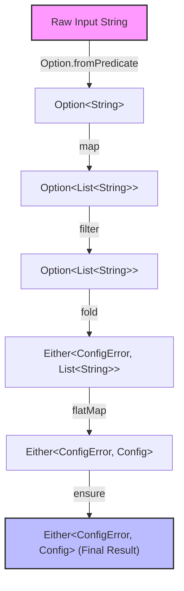

# Functional Composition

Functional composition lets you build powerful software by snapping together tiny, single-purpose functions. Forget messy variables and endless `if`-checks. Build seamless data pipelines where the output of one step flows perfectly into the next.

Daxle's fluent API makes writing these pipelines incredibly simple and wildly readable.


## Your Pipeline Toolkit: Core Combinators

Master these key operators (combinators) to transform and direct your data flows.

### Transform with `map`
Transform a successful value instantly. If you encounter a failure (`Left` or `None`), Daxle skips the work.

* **Why you need it**: You have a successful value and want to apply a safe, synchronous transformation.

```dart
final Option<String> input = Option.some('  100  ');
final Option<int> doubled = input
    .map((str) => str.trim())
    .map((str) => int.parse(str))
    .map((num) => num * 2); // Some(200)
```

### Chain with `flatMap`
Use `flatMap` when your next step might fail. It prevents messy, nested containers like `Either<L, Either<L, R>>` and keeps your chain perfectly flat.

* **Why you need it**: You want to chain fallible operations or async tasks.

```dart
// flatMap prevents nested Either types
Either<ParseError, int> parsePort(String input) {
  return Either.tryCatch(
    () => int.parse(input),
    (err, _) => ParseError('Not a number'),
  ).flatMap((port) => port >= 0 && port <= 65535
      ? Either.right(port)
      : Either.left(ParseError('Invalid port range')));
}
```

### Validate with `ensure`
Check if a successful value meets your rules. If it fails, `ensure` immediately triggers a failure state with your fallback value.

* **Why you need it**: You need instant, inline validation mid-pipeline.

```dart
final Either<String, int> age = Either.right(25);

final validatedAge = age.ensure(
  (n) => n >= 18,
  () => 'Must be at least 18 years old',
);
```

### Trigger Side-Effects with `tap`
Run side-effects like logging or analytics without breaking your pipeline. `tap` handles successes; `tapLeft` handles failures.

* **Why you need it**: You want to log data or trigger external systems without altering your pipeline's value.

```dart
final task = TaskEither.right('file_data.csv')
    .tap((data) => logger.info('Successfully loaded: ${data.length} bytes'))
    .tapLeft((err) => logger.severe('Pipeline failed: $err'));
```

### Resolve with `fold`
Unwrap your final values at the very end of the pipeline. `fold` forces you to handle both success and failure completely.

* **Why you need it**: You're passing data out of your pipeline and need a raw value.

```dart
final Either<Failure, Config> result = loadConfig();

final String statusMessage = result.fold(
  (failure) => 'Failed to initialize: ${failure.message}',
  (config) => 'Successfully initialized on host: ${config.host}',
);
```


## See the Pipeline in Action

Let's see the massive difference composition makes when reading and validating a configuration file.

### The Old Way: Clunky Imperative Code

```dart
// Imperative approach (hard to compose, relies on mutable variables)
Config? parseLogLine(String rawLine) {
  final cleaned = rawLine.trim();
  if (cleaned.isEmpty) return null;
  
  final parts = cleaned.split(',');
  if (parts.length < 3) return null;
  
  final port = int.tryParse(parts[1]);
  if (port == null || port < 1024) return null;
  
  return Config(host: parts[0], port: port, protocol: parts[2]);
}
```

### The Daxle Way: A Clean, Declarative Pipeline

```dart
import 'package:daxle/daxle.dart';

sealed class ConfigError {}
class EmptyInput extends ConfigError {}
class MalformedLine extends ConfigError {}
class InvalidPort extends ConfigError {}

// Fluent composition pipeline
Either<ConfigError, Config> parseConfigLine(String rawLine) {
  return Option.fromPredicate(rawLine.trim(), (s) => s.isNotEmpty)
      .map((s) => s.split(','))
      .filter((parts) => parts.length >= 3)
      .fold(
        () => Either.left(EmptyInput()),
        (parts) => Either.right(parts),
      )
      .flatMap((parts) {
        final host = parts[0];
        final rawPort = parts[1];
        final protocol = parts[2];
        
        return Option(int.tryParse(rawPort))
            .fold(
              () => Either.left(MalformedLine()),
              (port) => Either.right(Config(host: host, port: port, protocol: protocol)),
            );
      })
      .ensure(
        (config) => config.port >= 1024,
        () => InvalidPort(),
      );
}
```

### Watch the Data Flow

Watch how your types transform at each safe, testable step:



1. We start with a raw `String`.
2. `Option.fromPredicate` yields an `Option<String>`, resolving empty inputs to `None`.
3. We `.map()` it to split the string, yielding `Option<List<String>>`.
4. We `.filter()` to verify we have enough elements, yielding `Option<List<String>>` (becomes `None` if list size < 3).
5. We `.fold()` the `Option` into an `Either<ConfigError, List<String>>`, mapping `None` to our domain error `EmptyInput()`.
6. We `.flatMap()` to parse the port and instantiate our `Config` object, yielding `Either<ConfigError, Config>`.
7. We `.ensure()` that the port is not in a reserved range, yielding the final `Either<ConfigError, Config>`.

By combining tiny transformations, you've built a bulletproof, self-documenting pipeline that catches errors instantly.
